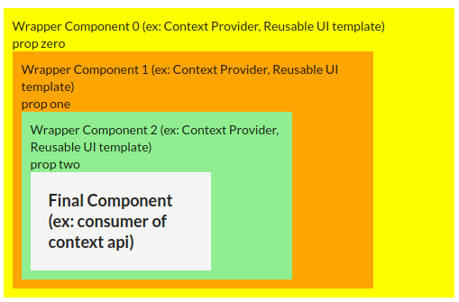

<p align="center">
    <h1 align="center">reactjs-compose</h1>
</p>
<p align="center">
    
    
    
    
    
</p>

<p align="center">
Reuse your components following React's best practices
</p>


# Installation

```
$ npm install --save reactjs-compose
```

# Motivation

Facebook is clear when recommending reusing components by composing components instead of using class inheritance.
For that to happen, you will likely be creating some Components that will enrich child components, either by passing data down via context api or by being a wrapper ui component that will work as a template or frame for the child components(ex: a landing page that reuses the header, footer in different pages).

https://reactjs.org/docs/composition-vs-inheritance.html

# Example




# Usage

The perfect example would be in the configuration of routes, where you will probably reuse some wrapper layouts or need some data from the Context API.

```js
import React from 'react'
import {
  BrowserRouter as Router,
  Switch,
  Route,
} from "react-router-dom"
import Compose from 'reactjs-compose'

interface Props {
  children: any
  [propName: string]: any
}

// ex: Authentication provider
function Component0(props: Props) {
  return (
    <div style={{ padding: '10px', background: 'yellow', width: '500px' }}>
      <span>Wrapper Component ZERO (ex: Context Provider, Reusable UI template)</span>
      <div>{props.text}{props.children}</div>
    </div>
  )
}

// ex: Products provider
function Component1(props: Props) {
  return (
    <div style={{ padding: '10px', background: 'orange', width: '400px' }}>
      <span>Wrapper Component ONE (ex: Context Provider, Reusable UI template)</span>
      <div>{props.text}{props.children}</div>
    </div>
  )
}

// ex: Base layout for the UI
function Component2(props: Props) {
  return (
    <div style={{ padding: '10px', background: 'lightgreen', width: '300px' }}>
      <span>Wrapper Component TWO (ex: Context Provider, Reusable UI template)</span>
      <div>{props.text}{props.children}</div>
    </div>
  )
}

function Home(props: Props) {
  return (
    <div style={{ padding: '20px', background: 'whitesmoke', width: '200px' }}>
      <h3>Final Component (ex: consumer of context api)</h3>
    </div>
  )
}

// Looks Bad
function Routes() {
  return (<Router>
    <Switch>
        <Route path="/"><Root /></Route>
        <Route path="/home" render={routerProps => (
            <Component0>
              <Component1>
                <Component2 text="comp two">
                  <Home text="text" {...routerProps}/>
                </Component2>
              </Component1>
            </Component0>
        )}>
        </Route>
        <Route path="/users"><Users /></Route>
        <Route path="/contact"><Contact /></Route>
    </Switch>
</Router>)
}

// Looks Good
function Routes() {
  return (<Router>
    <Switch>
        <Route path="/"><Root /></Route>
        <Route path="/home" render={routerProps => (
          <Compose components={[Component0, Component1, [Component2, { text: 'comp two' }]]}>
            <Home text="text" {...routerProps}/>
          </Compose>
        )} >
        </Route>
        <Route path="/users"><Users /></Route>
        <Route path="/contact"><Contact /></Route>
    </Switch>
</Router>)
}

// Looks Good too
const Home = [Component0, Component1, [Component2, { text: 'comp two' }]]

function Routes() {
  return (<Router>
    <Switch>
        <Route path="/"><Root /></Route>
        <Route path="/home" render={routerProps => (
            <Compose components={Home}>
              <Home text="text" {...routerProps} />
            </Compose>
        )}>
        </Route>
        <Route path="/users"><Users /></Route>
        <Route path="/contact"><Contact /></Route>
    </Switch>
</Router>)
}

```
